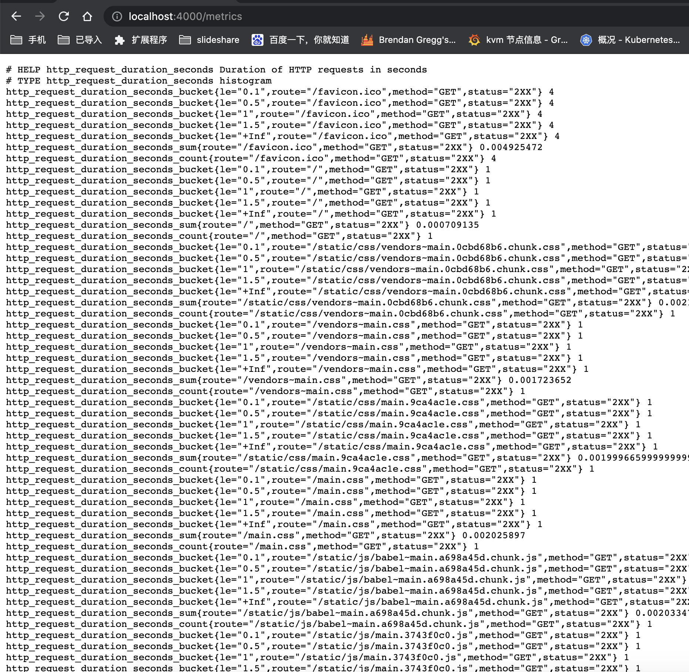
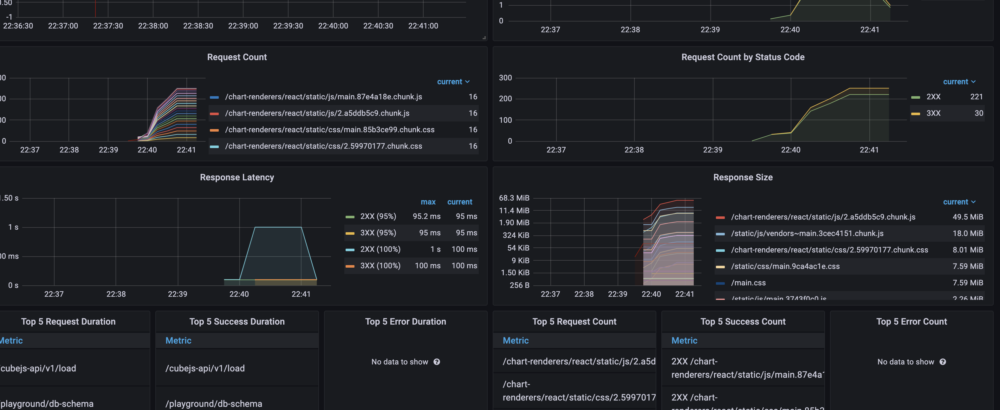

# cube.js with express prometheus middware


## how to running


```code
docker-compose up -d
CUBESTORE_SKIP_POST_INSTALL=true yarn
yarn dev
```


## view prometheus metrics

```code
http://localhost:4000/metrics
```


## some images




